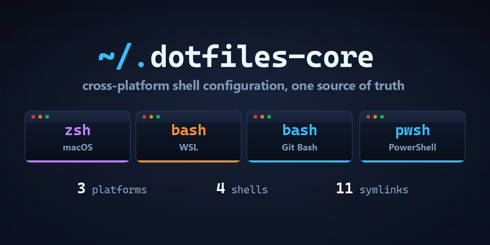

# dotfiles-core

[](https://github.com/marcop135/dotfiles-core/actions/workflows/ci.yml)

Cross-platform dotfiles for macOS, Windows, Git Bash, and WSL. This is the core: the part every machine shares. Identity, employer, and machine-specific configuration stays local.

One shared `sh` layer, platform-specific shell entrypoints, one manifest, and symlinks into your home directory. Configuration stays in one repository instead of drifting across machines.

## What's included

- Shell configuration, functions, and aliases
- [Starship](https://starship.rs) prompt
- Git configuration and global ignores
- Claude Code user configuration
- Local override points for machine-specific and private configuration

## Supported environments

| Platform | Shell      | Entry point                                |
| -------- | ---------- | ------------------------------------------ |
| macOS    | zsh        | `macos/zshrc`                              |
| Windows  | Git Bash   | `windows/bashrc` + `windows/bash_profile`  |
| Windows  | PowerShell | `windows/Microsoft.PowerShell_profile.ps1` |
| WSL      | bash       | `wsl/bashrc`                               |

The POSIX shells share the same `sh` layer. PowerShell has its own entrypoint because it cannot source POSIX shell configuration.

## Why

I use a Mac and a Windows machine that also runs WSL. Without a shared source of truth, shell and tool configuration gradually diverges.

Not included:

- Git identity
- Employer and client configuration
- Package lists
- macOS system settings
- Editor and terminal settings

## Requirements

- `git`
- One supported shell:
  - zsh on macOS
  - Git Bash on Windows
  - bash on WSL
  - PowerShell on Windows

[Starship](https://starship.rs) is optional. Without it, the shell uses its normal prompt.

Windows symlinks require permission to create them. Enable Developer Mode, or run the installer from an elevated shell. The installers report this requirement when it is missing.

## Install

Clone the repository anywhere:

```sh
git clone https://github.com/marcop135/dotfiles-core.git ~/code/dotfiles-core
cd ~/code/dotfiles-core
```

### macOS, WSL, and Git Bash

The installer is a dry run by default:

```sh
./scripts/install.sh
```

Review the plan, then apply it:

```sh
./scripts/install.sh --apply
```

### Windows PowerShell

The PowerShell installer is also a dry run by default:

```powershell
.\scripts\install.ps1
```

Review the plan, then apply it:

```powershell
.\scripts\install.ps1 -Apply
```

### Install a subset

Install only one module:

```sh
./scripts/install.sh --only shell
```

Skip a module:

```sh
./scripts/install.sh --skip prompt
```

## Installation manifest

`scripts/modules.conf` is the single manifest used by both installers and `check.sh`.

| Module   | Source                                     | Installed as                   | Environment          |
| -------- | ------------------------------------------ | ------------------------------ | -------------------- |
| `shell`  | `macos/zshrc`                              | `~/.zshrc`                     | macOS                |
| `shell`  | `windows/bashrc`                           | `~/.bashrc`                    | Git Bash             |
| `shell`  | `windows/bash_profile`                     | `~/.bash_profile`              | Git Bash             |
| `shell`  | `wsl/bashrc`                               | `~/.bashrc`                    | WSL                  |
| `shell`  | `windows/Microsoft.PowerShell_profile.ps1` | `$PROFILE.CurrentUserAllHosts` | PowerShell           |
| `prompt` | `shared/starship.toml`                     | `~/.config/starship.toml`      | macOS, WSL           |
| `prompt` | `windows/starship.toml`                    | `~/.config/starship.toml`      | Git Bash, PowerShell |
| `git`    | `shared/git/gitconfig`                     | `~/.gitconfig`                 | all                  |
| `git`    | `shared/git/ignore`                        | `~/.config/git/ignore`         | all                  |
| `claude` | `shared/claude/CLAUDE.md`                  | `~/.claude/CLAUDE.md`          | all                  |
| `claude` | `shared/claude/settings.json`              | `~/.claude/settings.json`      | all                  |

Files are linked, not copied. The repository remains the source of truth after installation.

## Shell

The shared shell layer lives in `shared/shell/` and is loaded by the POSIX shells.

### Functions

| Command          | Purpose                                               |
| ---------------- | ----------------------------------------------------- |
| `mkcd <dir>`     | Create a directory and enter it                       |
| `up 3`           | Move up three directory levels                        |
| `groot`          | Jump to the repository root                           |
| `path`           | Print `PATH`, one entry per line                      |
| `port 3000`      | Find the process using a port                         |
| `serve [port]`   | Serve the current directory over HTTP                 |
| `extract <file>` | Extract common archive formats                        |
| `ff <pattern>`   | Recursive search, skipping `.git`                     |
| `sizes [dir]`    | Show entries ordered by size                          |
| `update_all`     | Update npm, pipx, and the platform's package managers |

### Aliases

| Alias                 | Purpose                                |
| --------------------- | -------------------------------------- |
| `g`, `gs`, `gd`, `gl` | `git`, status, diff, and log           |
| `..`, `...`, `....`   | Move up one, two, or three directories |
| `-`                   | Return to the previous directory       |
| `ll`, `la`, `l`       | Long, all-files, and normal `ls`       |
| `cp`, `mv`            | Interactive overwrite protection       |
| `reload`              | Restart the shell in place             |

## Prompt

[Starship](https://starship.rs) is configured to stay quiet outside projects.

Language versions appear only in projects that use them. Git information appears only inside repositories.

`COLORFGBG`, set at shell startup from the OS appearance, keeps `bat`, `delta`, and `less` aligned with the terminal theme.

Refresh the theme without restarting the shell:

```sh
theme_refresh
```

PowerShell provides the equivalent:

```powershell
Update-Theme
```

## Git

Git configuration lives in:

```text
shared/git/gitconfig
shared/git/ignore
```

No Git identity is stored in this repository.

Put your identity in:

```text
~/.gitconfig.local
```

The tracked configuration contains portable settings and global ignores only.

## Claude Code

The repository includes two user-level Claude Code files:

```text
shared/claude/CLAUDE.md
shared/claude/settings.json
```

They are linked to:

```text
~/.claude/CLAUDE.md
~/.claude/settings.json
```

`CLAUDE.md` contains general instructions for sessions across repositories. A project's own `CLAUDE.md` or `AGENTS.md` is read afterward and takes precedence.

The user-level `settings.json` deliberately contains no allow list. Machine-specific command grants should stay machine-specific rather than being copied from a public repository.

It also:

- disables telemetry and error reporting
- disables the auto-updater
- follows the terminal theme
- prevents automatic commit trailers
- enables `acceptEdits`, while commands still require approval
- disables bypass-permissions mode
- disables auto mode
- denies `.env` files
- denies `secrets/` directories
- denies `~/.ssh` and the Claude credentials file
- denies `rm -rf`
- denies raw sockets and outbound tunnels
- denies common history-rewriting commands
- denies pushes to `main` and `develop`

The deny rules are a safety floor, not a security sandbox.

MCP servers are intentionally not included. User-scope MCP configuration lives in `~/.claude.json`, which Claude Code manages itself.

Hooks, agents, skills, and a statusline are also intentionally absent. They would introduce runtime dependencies that do not belong in this base configuration.

## Local overrides

Tracked configuration sources local overrides last, so local values win without modifying the repository.

| Tracked configuration     | Local override                                    |
| ------------------------- | ------------------------------------------------- |
| `~/.zshrc`, `~/.bashrc`   | `~/.shell.local`, plus shell-specific local files |
| PowerShell profile        | `profile.local.ps1` next to it                    |
| `~/.gitconfig`            | `~/.gitconfig.local`                              |
| `~/.config/starship.toml` | none                                              |
| `~/.config/git/ignore`    | none                                              |
| `~/.claude/settings.json` | none, use project `.claude/settings.local.json`   |

Create the shared shell override from the example:

```sh
cp shared/shell/local.sh.example ~/.shell.local
```

Anything private, machine-specific, or employer-specific belongs in these local files.

## Update

Pull the repository and re-run the installer:

```sh
git pull
./scripts/install.sh --apply
```

The installer is idempotent. Existing links are left alone and new configuration is linked.

## Uninstall

Uninstall is a dry run by default:

```sh
./scripts/install.sh --status
./scripts/install.sh --unlink
```

Apply the removal with:

```sh
./scripts/install.sh --unlink --apply
```

Existing files are never deleted. Before replacing an existing target, the installer renames it to:

```text
<target>.bak.<timestamp>
```

Uninstall only removes symlinks that point into this repository.

Restore the backups while unlinking:

```sh
./scripts/install.sh --unlink --restore --apply
```

## Tooling

| Command                          | Purpose                                                                        |
| -------------------------------- | ------------------------------------------------------------------------------ |
| `./scripts/install.sh`           | Install, inspect, or unlink configuration on POSIX shells                      |
| `.\scripts\install.ps1`          | Install, inspect, or unlink configuration from PowerShell                      |
| `./scripts/doctor.sh`            | Diagnose common configuration problems                                         |
| `.\scripts\doctor.ps1`           | Diagnose common Windows configuration problems                                 |
| `bash ./scripts/check.sh`        | Validate the manifest, file tree, Markdown, shell syntax, and ShellCheck        |
| `bash ./scripts/test-install.sh` | Test apply, unlink, and restore against a throwaway home directory             |
| `.\scripts\test-install.ps1`     | The same test for the PowerShell installer, `prompt` module only               |
| `./macos/bootstrap.sh`           | Bootstrap Homebrew, CLI tools, nvm, and Starship on a fresh Mac                |
| `./wsl/bootstrap.sh`             | Bootstrap packages, nvm, and Starship on a fresh WSL distribution              |

CI runs the installation lifecycle on macOS, Ubuntu, and Windows. Ubuntu is used as the WSL-equivalent environment because GitHub Actions does not provide a WSL runner.

## Contributing

Changes should preserve portability across the supported environments.

Before opening a pull request:

```sh
bash ./scripts/check.sh
bash ./scripts/test-install.sh
```

For changes to installation behavior, test the relevant installer in dry-run mode first.

New modules should be added to `scripts/modules.conf` so the installers and validation tooling continue to share the same source of truth.

Keep credentials, identities, employer-specific configuration, and other machine-specific data out of tracked files.

[AGENTS.md](AGENTS.md) is the working contract behind these rules: the constraints every change holds to, and what the manifest owns. [SECURITY.md](SECURITY.md) covers what the scripts do and do not do to a machine, and how to report a credential found in the tree. Notable changes are recorded in [CHANGELOG.md](CHANGELOG.md).

## Repository layout

```text
.
├── macos/
│   ├── bootstrap.sh
│   └── zshrc
├── windows/
│   ├── bash_profile
│   ├── bashrc
│   ├── Microsoft.PowerShell_profile.ps1
│   └── starship.toml
├── wsl/
│   ├── bashrc
│   ├── bootstrap.sh
│   ├── wsl.conf.example
│   └── .wslconfig.example
├── shared/
│   ├── claude/
│   ├── git/
│   ├── shell/
│   └── starship.toml
├── scripts/
│   ├── check.sh
│   ├── doctor.sh
│   ├── doctor.ps1
│   ├── install.sh
│   ├── install.ps1
│   ├── modules.conf
│   ├── test-install.sh
│   └── test-install.ps1
└── LICENSE
```

## License

[MIT](./LICENSE)

## Author

[Marco Pontili](https://marcopontili.com)
